# HW20. Huffman Part 1

## Learning Goals
* Learn Huffman decoding
* Understand reading bits from the file
* Using Tree traversal to decode
**Please read the entire file before you ask any question.**

This assignment is precursor to the next assignment. In both the assignments we will be learning to decode a compressed file, which was compressed using Huffman coding. To study more about Huffman coding please read Chapter 24 from Intermediate C Programming by Dr. Lu. Specifically, in this assignment we will learn to create the Huffman tree from the header given in a file. In the next assignment we will use this tree to decode the rest of the file.
Please understand the Huffman coding so that it easier for you to understand decoding. Let's consider the following example.

Huffman is variable length coding. Which means that each character, instead of being stored as an 8 bit  can be stored with any length of bits.

If the input file has the following content:
```
  ENNGGGGGGGGTTTTTTTgggggggggggggggggggpppppppppppppppppppppppd
  dddddddddddddddddddddddddddddddddddddddddddddhhhhhhhhhhhhhhh
  hhhhhhhhhhhhhhhhhhhhhhhhhhhhhhhhhhhhhhhhhhhhhhhhhhhhhhhhhh
```
Then, following Huffman tree is generated for compressing this file:


 For this assignment, we consider that going to left node in Huffman means adding `0` to the code and going to right means adding `1` to the code for the node. All the characters will be leaf node only, as can be seen from the Tree above. Thus, we will obtain the following codebook:
```
  h: 0
  d: 1 0
  p: 1 1 0
  T: 1 1 1 0 0
  E: 1 1 1 0 1 0 0
  N: 1 1 1 0 1 0 1
  G: 1 1 1 0 1 1
  g: 1 1 1 1

```

The codebook above is then used to compress the given file. The compressed file will be a binary file. As we saw in case of Image assignment earlier in the course, that an image file had an header and then the image. Similarly, the compressed file generated via Huffman coding contains an header and then the article (header is explained more in the following section). Please note that for every article/file, a different Huffman tree is geerated using the characters in the article, thus a different codebook which leads to a different header in the compressed binary file. Thus, we need to store the codebook used in header file. Please see the following bit structure for the compressed binary file for the above input file and using the codebook shown above:
```
  0000000: 10110100 01011001 00101110 00010101 01001010 00101101  
  0000006: 00111001 01000111 00101100 11100000 10110010 00000000  
  000000c: 00000000 00000000 00001010 11101001 11010111 10101111  
  0000012: 01111101 11110111 11011111 01111101 11110111 11001110  
  0000018: 01110011 10011100 11100111 00111111 11111111 11111111  
  000001e: 11111111 11111111 11111111 11111111 11111111 11111111  
  0000024: 11111111 01101101 10110110 11011011 01101101 10110110  
  000002a: 11011011 01101101 10110110 11010101 01010101 01010101  
  0000030: 01010101 01010101 01010101 01010101 01010101 01010101  
  0000036: 01010101 01010101 01010100 00000000 00000000 00000000  
  000003c: 00000000 00000000 00000000 00000000 00000000 00000000

```
### Header
The Huffman encoded binary file contains a header and then the rest of the file. Header is separated from the rest of the file by a newline `\n` character. There is only one newline `\n`, which appears after the header. Please notice that the header does not include the characters’ frequencies because this information is unnecessary for decoding.

The header includes the “commands” 1 or 0 to indicate whether the following information is a leaf node or not. If a command bit is 1, it must be followed by an ASCII character. ASCII codes go from 0 to 255 (this assignment ignores the characters whose values are greater than 256), and 2^8 = 256, which means that 8 bits is sufficient to store a character. Note, however, that if the command bit is 0, then it is different and is explained in `Decoding` section. If some bits in the last byte are unused, then these bits are zero. After writing the code book, the header uses the next 4 bytes (32 bits) to write the length of the article. This is an unsigned integer and can be as large as 2^32 − 1.

Thus header is actually:
```
  1h1d1p1T1E1N01G001g00000178
```
Since each letter uses 8 bits, the full header in binary format is :
```
10110100 01011001 00101110 00010101 01001010 00101101
00111001 01000111 00101100 11100000 10110010 00000000
00000000 00000000

```

The letter `h` is 0x68 in hexadecimal and the 8-bit representation is `01101000`. This can be seen in header as `10110100 0`. Similarly, The letter `d` is 0x64 and the 8-bit representation is `01100100`. The can be seen from the second byte and 2bit onwards to 3rd byte and 2bit : `1011001 00`. Please see the last 4 byte `10110010 00000000 00000000 00000000` is an integer with value `178`, which is the number of character in the file

# Decoding
To decode the header, we will follow the the following logic:
* The first bit of the first byte is a command bit and it is always 1.
* If a command is 1, then the next 8 bits(for this assignment) are the value stored in a leaf node. Create a tree node to store this value. Add this tree node to the beginning of the linked list. This tree node is a single-node tree.
* If a command is 0 and the list has two or more nodes, then take the first two nodes from the list, create a tree node as the parent. Add this parent node to the linked list.
* If a command is 0 and the list has only one node, then the complete tree has been built.
* After the tree is completely built, then read one more bit. If this is not the last (rightmost) bit of the byte, discard the remaining bits in the byte.

Let's consider the header in the binary format in the above example. We will build the Huffman tree from the header in the following format:

The header starts with bit 1, and we read the first character(i.e next 8 bits - which will be till 1st bit of 2nd byte):

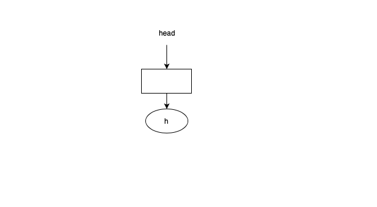

After reading first 2 characters(i.e. till 2nd bit of 3rd byte):

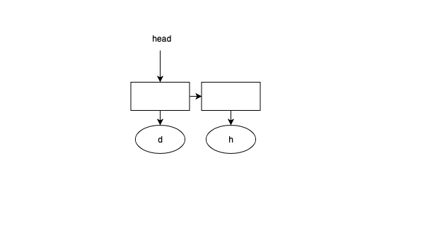

After reading 6 characters from the header, we will have the following LinkedList:

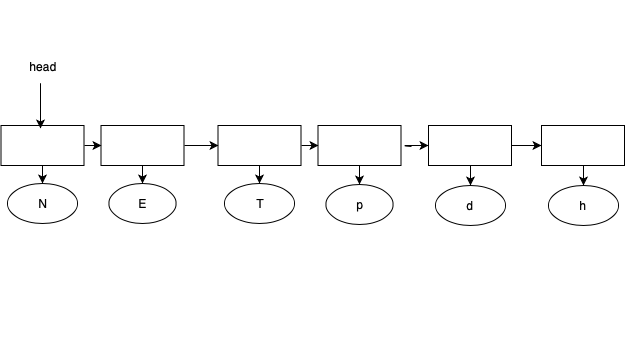

 The 7th bit in the seventh byte is a command and it is 0, thus we will combine the two nodes.
 Please note that we have to maintain which is left node and which is right node after merge. The
 second node taken out from LinkedList for merging becomes the left node, in the below example it is
 Tree node with value `E`

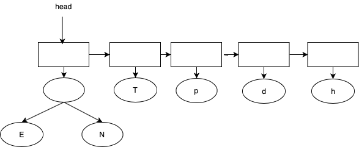

The next command bit (the 8th bit in the eighth byte) is 1

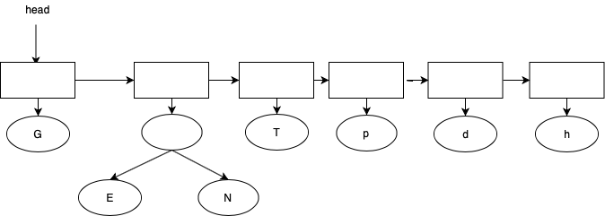

The next command (the first bit in the 9th byte) is 0. This will create a common parent for the first two tree nodes


The next command (the second bit in the 9th byte) is also 0

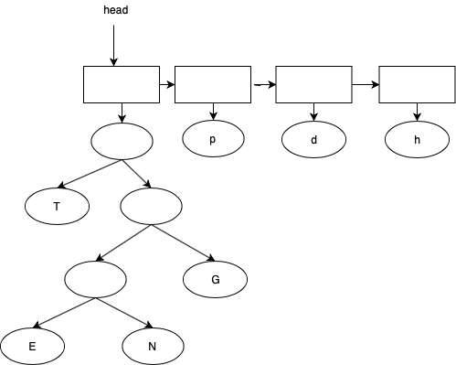

The next command (the third bit in the 9th byte) is 1. This will create a tree node to store the value g.

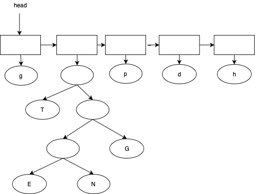

As we continue building the tree, we will get through the following steps
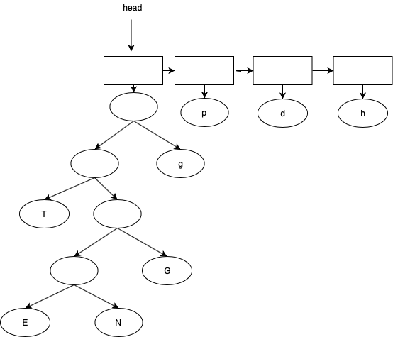
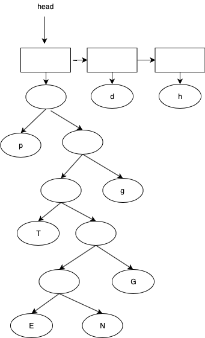
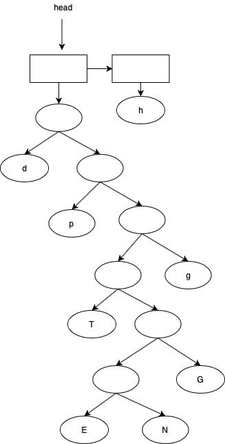
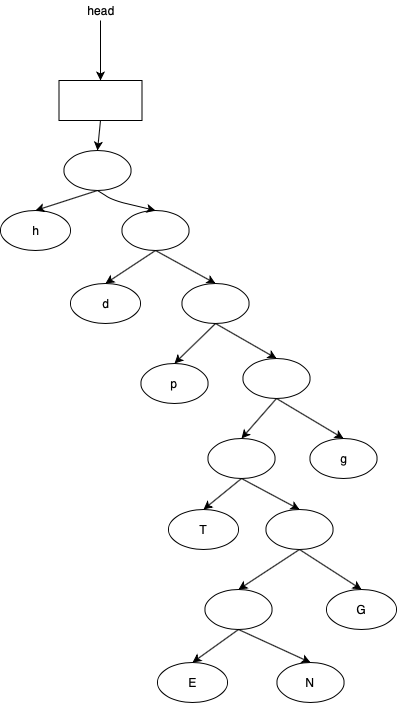

<!--  -->

# To Do
You would have to complete the following functions:

#### (decode.c): TreeNode * readHeader(FILE \* infptr)
This function takes input as file, reads the header as described above. This then creates a Huffman tree from the header, which will be used for decoding the file. As explained above in the decoding header, we will follow that logic.

Please read Intermediate C Programming for illustrative details regarding its understanding.

#### (decode.c): int decode(char * infile, char * outfile) in decode.c
For this assignment, `decode` function will 1st read the header by calling `readHeader` function. It will then print the obtained Huffman tree in the output file by using `Tree_print` function given to you. It then will read the next four bytes (an unsigned int) store the number of characters in the article. This number is followed by a new line ’\n’ character. It also prints the number of characters obtained from header in the file to the output file using `PrintNumberChar` function.

#### (list.c): ListNode \*  MergeListNode(ListNode \* head)
This function takes the first two nodes from the LinkedList starting from head.Merges the tree from the nodes. Insert the new Node with the tree obtained from merging the two above nodes. This node should be inserted in such a way that this node becomes the head of the LinkedList.

Please note that when you merge the TreeNodes using Tree_merge function, it is important to maintain the order of passing TreeNode and which TreeNode becomes right child and which becomes left child. For this assignment, our compression algorithm takes TreeNode from the second ListNode of the passed LinkedList and makes it the left child of the new merged TreeNode. This function should maintain the same aforementioned order. Please read Huffman coding for understanding the functionality of this function.


# Functions given to you
1. `readBit(FILE * fptr, unsigned char * bit, unsigned char * whichbit, unsigned char * curbyte)` - This function reads a byte from file into curbyte. Then from curbyte it reads single bit and puts it into `bit`. `whichbit` keeps track of bit we are reading from curbyte.
2. `ListNode * ListNode_create(TreeNode * tn)` - Creates a single node of type ListNode pointer with values as the input tree  
4. `ListNode * List_insert(ListNode * head, ListNode * ln)` - insert the node `ln` into the LinkedList. This function is like a stack, as new head of the LinkedList is `ln` after this operation.
5. `void List_print(ListNode * head)` - prints the LinkedList from the head
6. `TreeNode * TreeNode_create(char val, int freq)` - creates a single node of type TreeNode ptr
7. `TreeNode * Tree_merge(TreeNode * becomesLeftChild, TreeNode * becomesRighChild)` - merges the two TreeNode \* for Huffman and gives back the merged TreeNode. Merged Node will have `tn1` as the left child, `tn2` as the right child.  Please read the Huffman coding to understand the Tree merge functionality.
8. `void Tree_print(TreeNode * tn, int level, FILE *outfptr)` - prints the given tree in post order format
9. `void Tree_destroy(TreeNode * tn)` - free the memory for the Tree
10. `void PrintNumberChar(unsigned int numChar, FILE * outfptr)` - prints the numchar into the output file


#### Your Makefile should include

```
./$(TARGET) input/input(x).bin output(x).txt
diff -i -w output(x).txt expected/expected(x).txt
```
#### Testgenerator:
For this assignment, we have further given you a testgenerator, which can be used to generate more compressed files using Huffman coding. It is in the folder `testgenerator`. To generate any new compressed file, you should run the following command :

```
  ./testgen <file you want to compress>.txt <output file>.bin
```
After you run this, you will see that it prints 2 things:
1. Huffman tree - where the space in front of the print values represent the depth of the node
2. Codebook that gets generated using the Huffman tree  

for example, if we use testgenerator for the input file mentioned above in example, we will get the following result. As you can see that the Tree printed after running testgenerator is same as the one shown above in figure.
Please Note that `input.txt` file is also in the testgenerator folder for your help.
```
$ ./testgen input.txt output.bin

    freq = 73 value = 104, 'h'
      freq = 46 value = 100, 'd'
          freq = 23 value = 112, 'p'
                  freq = 7 value = 84, 'T'
                          freq = 1 value = 69, 'E'
                          freq = 2 value = 78, 'N'
                      freq = 3
                      freq = 7 value = 71, 'G'
                  freq = 10
              freq = 17
              freq = 19 value = 103, 'g'
          freq = 36
        freq = 59
  freq = 105
freq = 178
h: 0
d: 1 0
p: 1 1 0
T: 1 1 1 0 0
E: 1 1 1 0 1 0 0
N: 1 1 1 0 1 0 1
G: 1 1 1 0 1 1
g: 1 1 1 1

```

#### Flags to include
Please also include the following define flags for your Makefile.

```bash

-DTEST_READHEADER -DTEST_DECODE -DTEST_MERGELIST -DDO_NOT_MODIFY

```

#### Files to submit
Type the following command to zip your file.

```bash
	zip hw20.zip decode.c list.c
```
**You will not get any credits if the submitted file is not zipped**

The **only** way to submit homework is through Blackboard.

If your program has any compilation error or warning (remember to use
`gcc -std=c99 -g -Wall -Wshadow --pedantic -Wvla -Werror`), you will
receive zero in this assignment.
